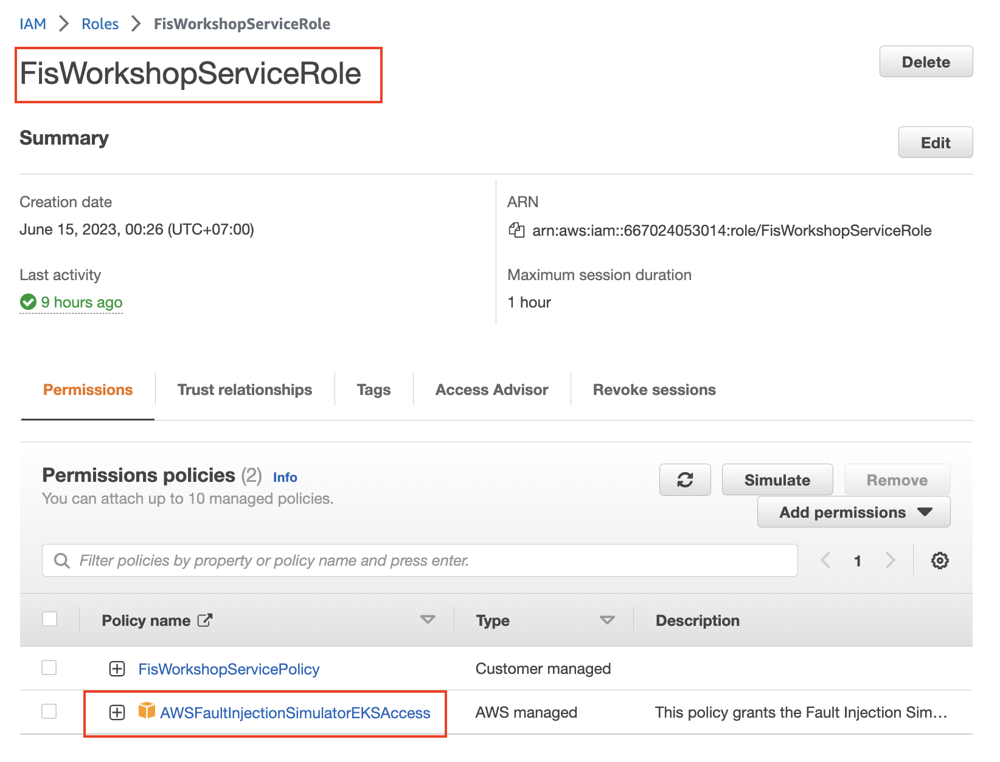

# AWS FIS Fault Injection EKS Actions

## Prerequisite
1. [Workshop Environment](https://catalog.us-east-1.prod.workshops.aws/workshops/5fc0039f-9f15-47f8-aff0-09dc7b1779ee/en-US)

---

## Instruction

### 1. Recommend to finish workshop on Amazon EKS Session


and [Configuring Permissions](https://catalog.us-east-1.prod.workshops.aws/event/dashboard/en-US/workshop/030-basic-content/030-basic-experiment/10-permissions)

---

### 2. Install eksctl

Download eksctl

```bash
curl --silent --location "https://github.com/weaveworks/eksctl/releases/latest/download/eksctl_$(uname -s)_amd64.tar.gz" | tar xz -C /tmp
```

Move eksctl to /usr/local/bin folder

```bash
sudo mv /tmp/eksctl /usr/local/bin
```

Checking the version

```bash
eksctl version

0.151.0
```

---

### 3. Config Service Account

This steps a refer to this [Instruction](https://docs.aws.amazon.com/fis/latest/userguide/eks-pod-actions.html)

#### 3.1 Add FIS EKS Policy to IAM Role

Add Policy name: `AWSFaultInjectionSimulatorEKSAccess` to IAM Role: `FisWorkshopServiceRole`



#### 3.2 Config Service Account

Create a file named `rbac.yaml` 

```bash
touch rbac.yaml
```

Add the following configuration. You can done by using `nano rbac.yaml`

```yaml
kind: ServiceAccount
apiVersion: v1
metadata:
  namespace: default
  name: myserviceaccount

---
kind: Role
apiVersion: rbac.authorization.k8s.io/v1
metadata:
  namespace: default
  name: role-experiments
rules:
- apiGroups: [""]
  resources: ["configmaps"]
  verbs: [ "get", "create", "patch", "delete"]
- apiGroups: [""]
  resources: ["pods"]
  verbs: ["create", "list", "get", "delete", "deletecollection"]
- apiGroups: [""]
  resources: ["pods/ephemeralcontainers"]
  verbs: ["update"]
- apiGroups: [""]
  resources: ["pods/exec"]
  verbs: ["create"]
- apiGroups: ["apps"]
  resources: ["deployments"]
  verbs: ["get", "list", "watch", "create", "update", "patch", "delete"]

---
apiVersion: rbac.authorization.k8s.io/v1
kind: RoleBinding
metadata:
  name: bind-role-experiments
  namespace: default
subjects:
- kind: ServiceAccount
  name: myserviceaccount
  namespace: default
- apiGroup: rbac.authorization.k8s.io
  kind: User
  name: fis-experiment
roleRef:
  kind: Role
  name: role-experiments
  apiGroup: rbac.authorization.k8s.io
```

#### 3.3 Run the following command

```bash
kubectl apply -f rbac.yaml
```

#### 3.4 Get current user role

```bash
aws sts get-caller-identity

{
    "UserId": "AROAZWTN3KMLBIDB7NKPX:Participant",
    "Account": "${ACCOUNT_ID}",
    "Arn": "arn:aws:sts::${ACCOUNT_ID}:assumed-role/WSParticipantRole/Participant"
}
```

Note that current user is assume `WSParticipantRole`. So that, we will copy `WSParticipantRole` ARN by copy from AWS Console then save to tmp file.


#### 3.5 Map your IAM entity manually by editing the aws-auth ConfigMap

```bash
kubectl edit configmap aws-auth --namespace kube-system
```

Under `data` and `mapRoles:`. Add you Role arn as follows.

```yaml
{"rolearn":"arn:aws:iam::${ACCOUNT_ID}:role/WSParticipantRole","username":"arn:aws:iam::${ACCOUNT_ID}:role/WSParticipantRole","groups":["system:masters"]}
```

Complete `mapRoles`

```yaml
apiVersion: v1
data:
  mapAccounts: '[]'
  mapRoles: '[{"rolearn":"arn:aws:iam::${ACCOUNT_ID}:role/WSParticipantRole","username":"arn:aws:iam::${ACCOUNT_ID}:role/WSParticipantRole","groups":["system:masters"]},{"rolearn":"arn:aws:iam::${ACCOUNT_ID}:role/FisStackEks-ClusterMastersRole9AA35625-8651X4FTK10Y","username":"arn:aws:iam::${ACCOUNT_ID}:role/FisStackEks-ClusterMastersRole9AA35625-8651X4FTK10Y","groups":["system:masters"]},{"rolearn":"arn:aws:iam::${ACCOUNT_ID}:role/FisStackEks-ClusterNodegroupManagedNodeGroupNodeGr-FS0LROV6OHAI","username":"system:node:{{EC2PrivateDNSName}}","groups":["system:bootstrappers","system:nodes"]}]'
```

#### 3.6 Mapping your experiment role to the Kubernetes user

Now, you have autorize to perform mapping your experiment role to the Kubernetes user

```bash
eksctl create iamidentitymapping \
    --arn arn:aws:iam::${ACCOUNT_ID}:role/FisWorkshopServiceRole \
    --username fis-experiment \
    --cluster FisWorkshop-EksCluster
```

#### 3.7 Testing user

Test `fis-experiment` user can get pod. Result should be `yes`.

```bash
kubectl auth can-i get pod --as=fis-experiment
yes
```

---

### 4. Create Experiment Template: Delete Pod Name

#### 4.1 Name and Role

add "Name" of `FisWorkshopEKSDeletePod`

add "Description" of `Delete Pod`

use `FisWorkshopServiceRole` as execution role


#### 4.2 Action

`Name` enter `EKSDeletePod` and you can skip the Description.
`Action type` select `aws:eks:pod-delete`. 
`kubernetesServiceAccount` enter `myserviceaccount`
Select "Save".


#### 4.3 Target

On the "Edit target" popup select `aws:eks:pod` as Resoure type. 
`Cluster Identifier` is `FisWorkshop-EksCluster`. 
`Namespace` is `Default` 
`Selector Type` is `podName`
`Selector Value` is `your-pod-name`. 
Select "Save" and `Create Experimental`


#### 4.4 Create experiment template

Select "Create" and enter `create` to Create experiment template


#### 4.5 Start experiment and monitor

select the `FisWorkshopEKSDeletePod` experiment template you created above
select Start experiment from the Action drop-down menu
add a `Name` tag of `FisWorkshopEKSDeletePod_1`
confirm that you want to start an experiment


You will see that FIS will delete your pod as expected 

```bash
kubectl get po -w
NAME                                          READY   STATUS    RESTARTS   AGE
fispod-b238337d-4c9d-3b3d-9735-0db78b5d4115   1/1     Running   0          7s
hello-kubernetes-cc6888859-5gwnm              1/1     Running   0          75m
hello-kubernetes-cc6888859-pbmdb              1/1     Running   0          33m
hello-kubernetes-cc6888859-5gwnm              1/1     Terminating   0          75m
hello-kubernetes-cc6888859-mj2xq              0/1     Pending       0          0s
hello-kubernetes-cc6888859-mj2xq              0/1     Pending       0          0s
hello-kubernetes-cc6888859-mj2xq              0/1     ContainerCreating   0          0s
hello-kubernetes-cc6888859-5gwnm              0/1     Terminating         0          75m
hello-kubernetes-cc6888859-5gwnm              0/1     Terminating         0          75m
hello-kubernetes-cc6888859-5gwnm              0/1     Terminating         0          75m
hello-kubernetes-cc6888859-mj2xq              1/1     Running             0          2s
```

---

### 5. Create Experiment Template: Delete Pod by Deployment Name

You can follow Section 4) to create experiment template and start experiment.

The only difference are in experiment template to set `Target` as follows.:

Selector Type is `Deployment Name`
Selector Value is `your-deployment-name`. 


```bash
kubectl get po -w
NAME                                          READY   STATUS    RESTARTS   AGE
fispod-05a8f16a-3e33-3996-9be2-c03cd8eb9a58   1/1     Running   0          12s
hello-kubernetes-cc6888859-mj2xq              1/1     Running   0          10m
hello-kubernetes-cc6888859-pbmdb              1/1     Running   0          44m
hello-kubernetes-cc6888859-pbmdb              1/1     Terminating   0          45m
hello-kubernetes-cc6888859-mj2xq              1/1     Terminating   0          11m
hello-kubernetes-cc6888859-hpjmn              0/1     Pending       0          0s
hello-kubernetes-cc6888859-hpjmn              0/1     Pending       0          0s
hello-kubernetes-cc6888859-jmdwz              0/1     Pending       0          0s
hello-kubernetes-cc6888859-hpjmn              0/1     ContainerCreating   0          0s
hello-kubernetes-cc6888859-jmdwz              0/1     Pending             0          0s
hello-kubernetes-cc6888859-jmdwz              0/1     ContainerCreating   0          0s
hello-kubernetes-cc6888859-pbmdb              0/1     Terminating         0          45m
hello-kubernetes-cc6888859-pbmdb              0/1     Terminating         0          45m
hello-kubernetes-cc6888859-pbmdb              0/1     Terminating         0          45m
hello-kubernetes-cc6888859-mj2xq              0/1     Terminating         0          11m
hello-kubernetes-cc6888859-mj2xq              0/1     Terminating         0          11m
hello-kubernetes-cc6888859-mj2xq              0/1     Terminating         0          11m
hello-kubernetes-cc6888859-jmdwz              1/1     Running             0          1s
hello-kubernetes-cc6888859-hpjmn              1/1     Running             0          2s
```


---

## References

- [Chaos Engineering / Fault Injection Simulator (FIS) workshop](https://catalog.us-east-1.prod.workshops.aws/workshops/5fc0039f-9f15-47f8-aff0-09dc7b1779ee/en-US)

- [Use the AWS FIS aws:eks:pod actions](https://docs.aws.amazon.com/fis/latest/userguide/eks-pod-actions.html)

---